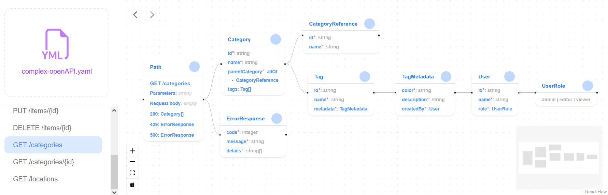
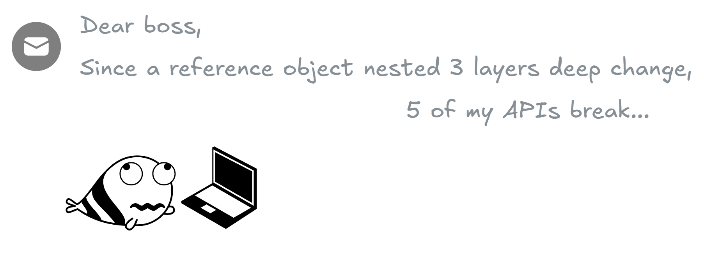
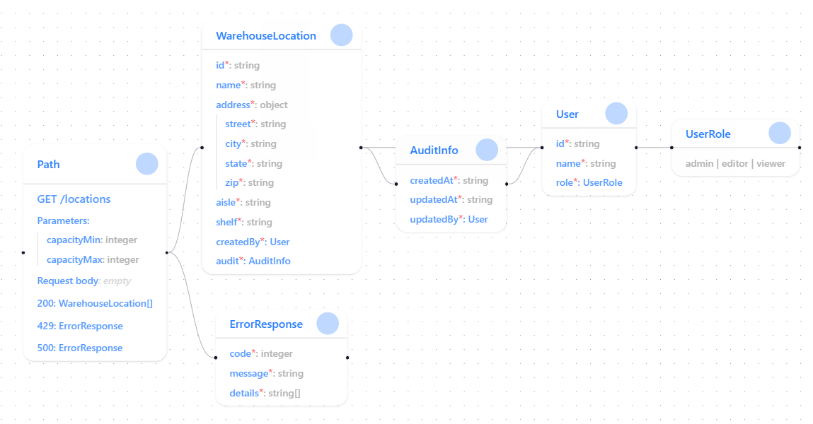
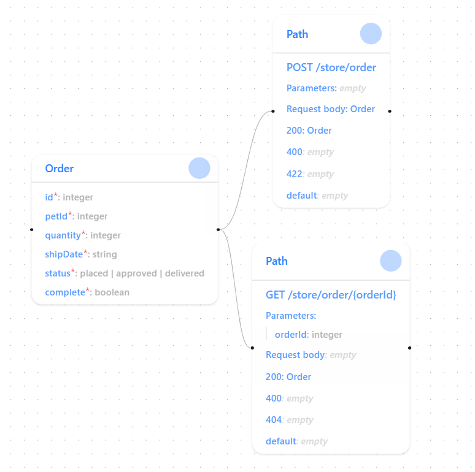
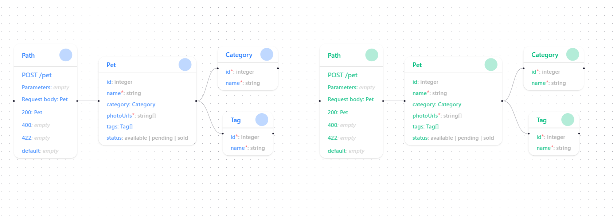
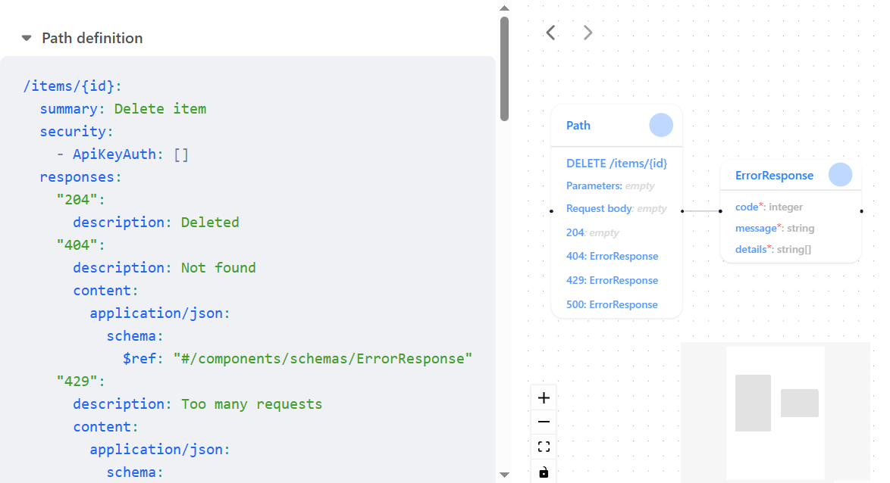
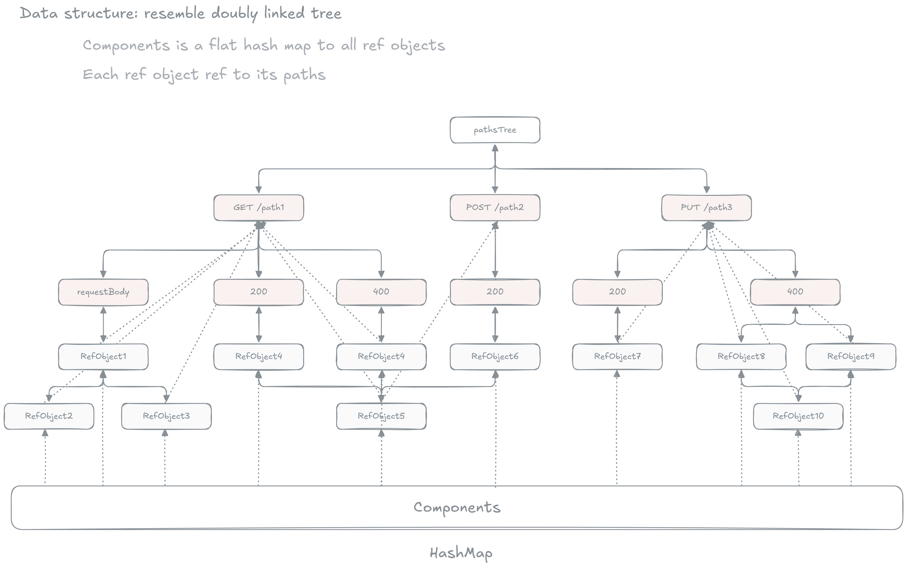
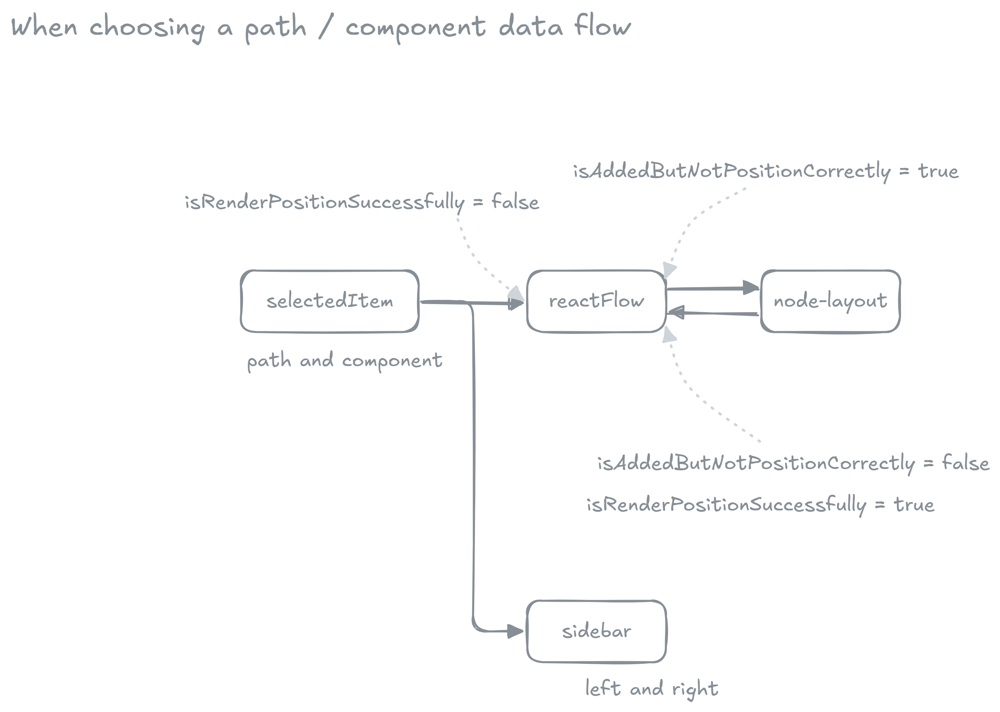

# OpenAPI / Swagger visualizer



*Easily visualize complex OpenAPI / Swagger API structure*

Have you ever had to compare two massive OpenAPI files, each with 5,000 lines, and then write a report about it? I have - and that's why I created this tool. 

You can check it out here: .



## Features

- View API request along with all its referenced objects



- Find all API requests where a reference object is used



- Compare 2 API requests from different files together



- View yaml definition and visualization side by side



## How it works

I use:
- [React Flow](https://reactflow.dev) to draw beautiful diagram
- [Valtio](https://valtio.dev/) to do the store management (somehow just basic proxy object with subscribe function become quite powerful)

When you drop a file, the application parse that file and make a kind-of doubly linked tree structure from that file.



- Each path doubly link to its request body, 200 response, 400 response,...
- Each request body and response doubly link to its reference objects
- A reference objects also point to its path
- A hash map called `components` will point to all reference objects

The nodes and edges to draw will be globally stored in `store/reactFlow.ts`.

When you choose a path or a reference object (component) to view, here's how the data flow:



- First, the selected item change (`store/selectedItem.ts`)
- The subscribe function in `store/reactFlow.ts` listen to selected item changed will add its corresponding tree to the canvas
- The `components/node-layout` using [Dagre.js](https://github.com/dagrejs/dagre/wiki) will calculate layout and update back into the reactFlow store

See all my diagrams in the `/docs` folder.

## Setup

Install the dependencies:

```bash
pnpm install
```

## Get started

Start the dev server, and the app will be available at [http://localhost:3000](http://localhost:3000).

```bash
pnpm dev
```

Build the app for production:

```bash
pnpm build
```

Preview the production build locally:

```bash
pnpm preview
```

## License

This application is released under [MIT licensed](/LICENSE).
